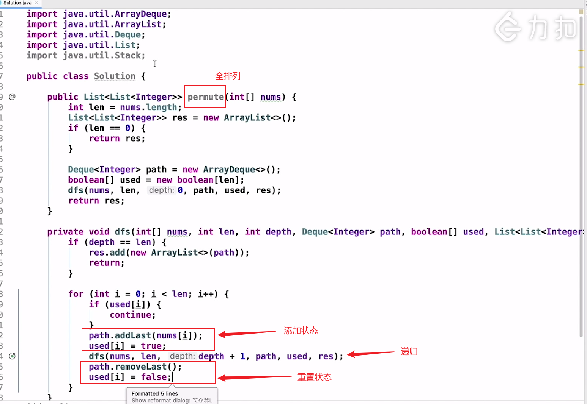

## labuladong

- [GiteePages 地址](https://labuladong.gitee.io/algo/)
- [GitHub Pages 地址](https://labuladong.github.io/algo/)
- github 仓库上内容不完整

## 目录

### ♢ 第零章、必读文章

- [x] 学习算法和刷题的框架思维
- [ ] 动态规划解题套路框架
- [ ] 回溯算法解题套路框架
  - 全排列
    - 如何用 广度优先搜素 实现？
    - [官方视频讲解](https://leetcode-cn.com/problems/permutations/solution/quan-pai-lie-by-leetcode-solution-2/)
    - 
- [ ] BFS 算法解题套路框架
- [ ] 一文搞懂单链表的六大解题套路
- [ ] 对上述框架思维的总结和概述
- [ ] 一文秒杀所有岛屿题目
- [ ] 我写了首诗，让你闭着眼睛也能写对二分搜索
- [ ] 我写了首诗，把滑动窗口算法算法变成了默写题
- [ ] 我写了一个模板，把 Dijkstra 算法变成了默写题
- [ ] 一个方法团灭 LeetCode 股票买卖问题
- [ ] 一个方法团灭 LeetCode 打家劫舍问题
- [ ] 一个方法团灭 nSum 问题
- [ ] 提高刷题幸福感的小技巧

### ♤ 第一章、手把手刷数据结构

#### ♤ 手把手刷链表题目

- [ ] 一文搞懂单链表的六大解题套路
- [ ] 递归反转链表的一部分
- [ ] 如何 k 个一组反转链表
- [ ] 如何判断回文链表

#### ♡ 手把手刷二叉树

- [ ] 手把手带你刷二叉树（第一期）
- [ ] 手把手带你刷二叉树（第二期）
- [ ] 手把手带你刷二叉树（第三期）
- [ ] 手把手带你刷二叉搜索树（第一期）
- [ ] 手把手带你刷二叉搜索树（第二期）
- [ ] 手把手带你刷二叉搜索树（第三期）
- [ ] 美团面试官：你对后序遍历一无所知
- [ ] 二叉树的序列化，就那几个框架，枯燥至极
- [ ] 题目不让我干什么，我偏要干什么
- [ ] Git 原理之最近公共祖先
- [ ] 如何计算完全二叉树的节点数

#### ♤ 手把手刷图算法

♣︎ 图论基础
♠︎ 拓扑排序，YYDS！
♥︎ 二分图判定
♥︎ Union-Find 算法详解
♦︎ Union-Find 算法应用
♠︎ 众里寻他千百度：名流问题
♥︎ 我写了一个模板，把 Dijkstra 算法变成了默写题

#### ♢ 手把手设计数据结构

♠︎ 算法就像搭乐高：带你手撸 LRU 算法
♦︎ 算法就像搭乐高：带你手撸 LFU 算法
♠︎ 数据结构设计：最大栈
♥︎ 一道求中位数的算法题把我整不会了
♦︎ 设计朋友圈时间线功能
♠︎ 单调栈结构解决三道算法题
♦︎ 单调队列结构解决滑动窗口问题
♥︎ 二叉堆详解实现优先级队列
♣︎ 队列实现栈以及栈实现队列

#### ♢ 手把手刷数组题目

- [ ] 小而美的算法技巧：前缀和数组
- [ ] 小而美的算法技巧：差分数组
- [ ] 双指针技巧总结
- [ ] 滑动窗口技巧
- [ ] 我写了首诗，让你闭着眼睛也能写对二分搜索
- [ ] 二分搜索怎么用？我又总结了套路
- [ ] 我和快手面试官对二分搜索进行了深度探讨
- [ ] 田忌赛马背后的算法决策
- [ ] 给我常数时间，我可以删除/查找数组中的任意元素
- [ ] 一道数组去重的算法题把我整不会了
- [ ] 一文秒杀四道原地修改数组的算法题
- [ ] twoSum 问题的核心思想

### ♢ 第二章、手把手刷动态规划

#### ♢ 动态规划基本技巧

♣︎ 动态规划解题核心框架
♣︎ 动态规划设计：最长递增子序列
♦︎ 动态规划答疑篇
♦︎ base case 和备忘录的初始值怎么定？
♣︎ 对动态规划进行降维打击
♣︎ 动态规划和回溯算法到底谁是谁爹？

#### ♧ 子序列类型问题

♣︎ 经典动态规划：编辑距离
♣︎ 动态规划设计：最长递增子序列
♦︎ 二维递增子序列：信封嵌套问题
♠︎ 动态规划设计：最大子数组
♠︎ 经典动态规划：最长公共子序列
♦︎ 动态规划之子序列问题解题模板

#### ♢ 背包类型问题

♥︎ 经典动态规划：0-1 背包问题
♠︎ 经典动态规划：子集背包问题
♥︎ 经典动态规划：完全背包问题

#### ♧ 用动态规划玩游戏

♣︎ 动态规划之最小路径和
♦︎ 动态规划帮我通关了《魔塔》
♠︎ 动态规划帮我通关了《辐射 4》
♦︎ 旅游省钱大法：加权最短路径
♣︎ 经典动态规划：正则表达式
♥︎ 经典动态规划：高楼扔鸡蛋
♠︎ 经典动态规划：高楼扔鸡蛋（进阶）
♣︎ 经典动态规划：戳气球
♥︎ 经典动态规划：博弈问题
♦︎ 经典动态规划：四键键盘
♦︎ 团灭 LeetCode 股票买卖问题
♠︎ 团灭 LeetCode 打家劫舍问题
♣︎ 有限状态机之 KMP 字符匹配算法
♦︎ 构造回文的最小插入次数

#### ♡ 贪心类型问题

♠︎ 贪心算法之区间调度问题
♥︎ 扫描线技巧：安排会议室
♥︎ 剪视频剪出一个贪心算法
♣︎ 如何运用贪心思想玩跳跃游戏
♦︎ 当老司机学会了贪心算法

### ♧ 第三章、必知必会算法技巧

#### ♤ 暴力搜索算法 (DFS，BFS)

♥︎ 回溯算法解题套路框架
♠︎ 回溯算法牛逼：集合划分问题
♠︎ 回溯算法团灭子集、排列、组合问题
♣︎ 回溯算法最佳实践：解数独
♦︎ 回溯算法最佳实践：括号生成
♥︎ BFS 算法解题套路框架
♦︎ 如何用 BFS 算法秒杀各种智力题

#### ♡ 数学运算技巧

♣︎ 常用的位操作
♦︎ 讲两道常考的阶乘算法题
♥︎ 如何高效寻找素数
♦︎ 如何高效进行模幂运算
♥︎ 如何寻找缺失的元素
♣︎ 如何同时寻找缺失和重复的元素
♥︎ 如何在无限序列中随机抽取元素
♦︎ 如何去除有序数组的重复元素
♥︎ 一行代码就能解决的算法题
♣︎ 几个反直觉的概率问题

#### ♢ 其他算法技巧

♦︎ 小而美的算法技巧：前缀和数组
♥︎ 小而美的算法技巧：差分数组
♣︎ 快速排序亲兄弟：快速选择算法
♥︎ 分治算法详解：运算优先级
♠︎ 一个方法解决三道区间问题

#### ♤ 经典面试题

♦︎ 谁能想到，斗地主也能玩出算法
♦︎ 东哥吃葡萄时竟然吃出一道算法题！
♥︎ 烧饼排序算法
♣︎ 字符串乘法计算
♠︎ 如何实现一个计算器
♣︎ 如何高效解决接雨水问题
♦︎ 如何寻找最长回文子串
♥︎ 如何解决括号相关的问题
♦︎ 如何判定完美矩形
♦︎ 如何调度考生的座位
♥︎ 二分查找高效判定子序列

#### ♡ 通用计算机技术

♦︎ Linux 文件系统都是什么鬼
♠︎ Linux 的进程、线程、文件描述符是什么
♣︎ 关于 Linux shell 你必须知道的
♥︎ Linux shell 的实用小技巧
♦︎ Linux 管道符原理大揭秘
♦︎ 一文看懂 session 和 cookie
♣︎ 加密算法的前身今世
♦︎ 我用四个命令概括了 Git 的所有套路
♥︎ Git/SQL/正则表达式的在线练习平台
